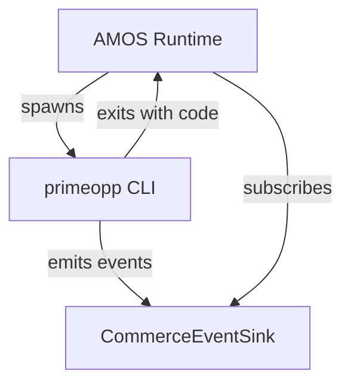

# AMOS Integration Guide

AMOS is a VERIDIAN sibling product. This package exposes integration seams for AMOS but does NOT implement AMOS.

## Operating System Seams

AMOS can integrate via:

- **Commerce events**: subscribe to `CommerceEventSink` for OS-level telemetry
- **Filesystem**: all file paths use `join()` with forward slashes for cross-platform compatibility
- **Process**: `npm run verify` exits with standard exit codes (0 success, 1 failure)
- **Environment**: no environment variables required for verification

## Path Portability

All paths in this package use `node:path`'s `join()` and forward slashes. Tests run on Linux and Windows (forward slashes work on both via Node's path module).

## Mermaid: AMOS Integration

