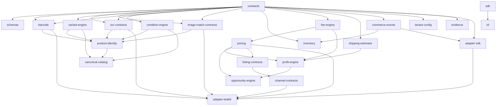

# Architecture

## Overview

PrimeOpp Commerce Core is a multi-package TypeScript monorepo organized around the principle that **products consume reusable capabilities**. There is no circular dependency; shared packages expose stable contracts, and adapters depend only on those contracts.

## Package Dependency Graph

## Layering

The packages form four layers:

1. **Foundation layer** — `contracts`, `schemas`. Pure types and runtime validators. No external dependencies.
2. **Contracts layer** — `barcode`, `ocr-contracts`, `image-match-contracts`, `commerce-events`, `tenant-config`, `evidence`. Pure contract packages that define interfaces for external capabilities.
3. **Engine layer** — `variant-engine`, `condition-engine`, `product-identity`, `canonical-catalog`, `inventory`, `pricing`, `fee-engine`, `shipping-estimator`, `profit-engine`, `opportunity-engine`, `listing-contracts`, `channel-contracts`. These contain real business logic.
4. **Integration layer** — `adapter-sdk`, `adapter-testkit`, `sdk`, `cli`. These wire engines together and expose them to callers.

## Key Architectural Decisions

### 1. No silent failures
Every public engine operation returns an `OperationResult<T>` with an explicit `TerminalState` (`SUCCEEDED`, `PARTIALLY_SUCCEEDED`, `REQUIRES_REVIEW`, `FAILED`, `CANCELLED`). There is no "no result" state.

### 2. Tenant isolation is enforced at every layer
Every record carries `tenantId`. Every storage adapter filters by tenant. Every cross-tenant access attempt throws a `CROSS_TENANT_*` error.

### 3. Adapters are contracts, not implementations
External providers (eBay, Amazon, OCR services, image match services, fee schedules, shipping carriers) are represented as TypeScript interfaces in `contracts`. Concrete adapters live in `adapter-testkit` and are clearly labeled TEST-ONLY.

### 4. Idempotency is built-in
Every mutating operation accepts an `idempotencyKey`. The engine tracks the last N keys per record and replays the prior result if a key repeats.

### 5. Concurrency safety via per-record Promise chains
The inventory engine serializes operations per record using a Promise chain lock, preventing oversell in concurrent scenarios.

### 6. Native TypeScript execution
Source files use `.ts` extensions throughout. Node 22+ runs them directly via type stripping. There is no separate build step — `npm run build` is an alias for `npm run typecheck`.

### 7. PrimeOpp Marketplace is a first-class channel
The listing model has an explicit `alsoListOnPrimeOppMarketplace` flag that defaults to TRUE. Users must explicitly opt out; the opt-out produces evidence of the decision.

### 8. No external API dependencies for verification
`npm run verify` works entirely offline. All test adapters are deterministic and labeled TEST-ONLY. No credentials, paid APIs, or network access required.
