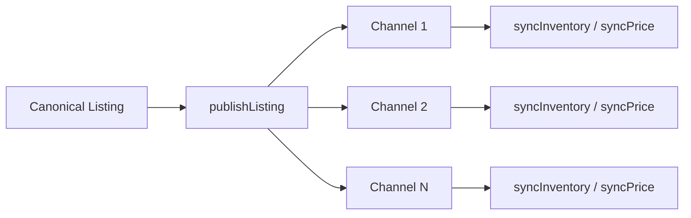

# Channel Adapters

Channel adapter contracts live in `packages/channel-contracts/src/index.ts`.

## Adapter Interface

```typescript
interface MarketplaceChannelAdapter {
  readonly adapterId: string;
  readonly version: string;
  readonly channelRef: string;
  readonly testOnly: boolean;
  readonly capabilities: ChannelCapability[];
  getCapabilityManifest(): ChannelCapabilityManifest;
  publishListing(request: ChannelPublishRequest): Promise<ChannelPublishResult>;
  updateListing?(...): Promise<ChannelPublishResult>;
  pauseListing?(...): Promise<ChannelSyncResult>;
  endListing?(...): Promise<ChannelSyncResult>;
  markSold?(...): Promise<ChannelSyncResult>;
  syncInventory?(...): Promise<ChannelSyncResult>;
  syncPrice?(...): Promise<ChannelSyncResult>;
}
```

## Capabilities

15 capabilities: PUBLISH_LISTING, UPDATE_LISTING, PAUSE_LISTING, END_LISTING, MARK_SOLD, SYNC_INVENTORY, SYNC_PRICE, RECEIVE_OFFER, RESPOND_TO_OFFER, RECEIVE_ORDER, RECEIVE_RETURN, RETRIEVE_LISTING_STATUS, RETRIEVE_ERRORS, RETRIEVE_FEES, RETRIEVE_CATEGORY_REQUIREMENTS.

## Conformance Suite

`runConformanceSuite(adapter)` returns test results for:

- identity (adapterId, version)
- capability.publish (PUBLISH_LISTING present)
- conditionMappings (all required conditions mapped)
- testOnlyFlag (correctly labeled)
- publishRequiresAcceptance (rejects without userAccepted)

## Local Test Adapters

- `LocalTestChannelAdapter` (TEST-ONLY) — generic fake channel
- `PrimeOppMarketplaceTestAdapter` (TEST-ONLY) — PrimeOpp Marketplace test adapter

## Critical Rule

**Do not implement eBay, Amazon, Walmart, Facebook, Depop, GOAT or another live marketplace.** Only test adapters are provided. Real marketplace adapters are future integration seams.

## Mermaid: Multi-Channel Listing


