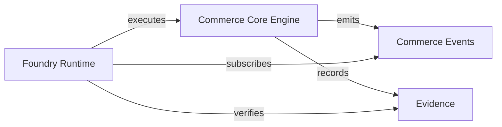

# Foundry Integration Guide

Foundry is the canonical execution runtime in the VERIDIAN ecosystem. This package exposes Foundry integration seams but does NOT implement Foundry.

## Execution Seams

Foundry can execute operations via:

- `InventoryEngine.execute(op)` — inventory mutations
- `CanonicalCatalog.create/update/merge/split/archive` — catalog mutations
- `MarketplaceChannelAdapter.publishListing` — channel publication
- All operations accept a `TenantScoped` scope that Foundry can populate from the calling context

## Event Consumption

Foundry can subscribe to commerce events via `CommerceEventSink.subscribe(handler)`. Every event carries:

- `eventId` (UUID)
- `schemaVersion`
- `tenantId`, `organizationId`
- `correlationId`
- `timestamp`
- `source` and `subject`
- `type` (one of 25 commerce event types)
- `payload`
- `evidenceRefs`
- `sensitivity`

## Evidence Recording

Foundry can verify material execution results via:

- `EvidenceStore.verify(id)` — content hash verification
- `buildEvidenceRecord(opts)` — construct evidence records
- `contentHash(value)` — compute deterministic content hashes

## Critical Rule

**Do not implement Foundry inside this package.** Foundry is the consumer; this package is the contract provider.

## Mermaid: Future Foundry Integration

