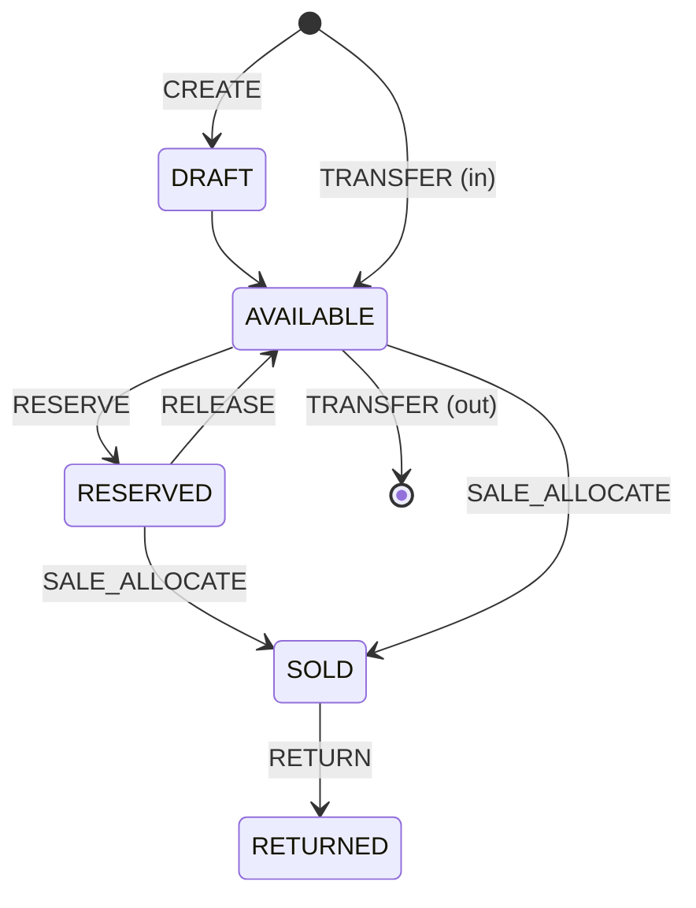

# Inventory Engine

The inventory engine lives in `packages/inventory/src/index.ts`.

## Inventory States

14 states: DRAFT, INBOUND, AVAILABLE, RESERVED, LISTED, PARTIALLY_LISTED, SOLD, PARTIALLY_SOLD, SHIPPED, DELIVERED, RETURN_REQUESTED, RETURNED, DAMAGED, LOST, ARCHIVED.

## Quantity Buckets

Every `InventoryRecord.quantities` carries 8 buckets: available, reserved, committed, sold, damaged, returned, inbound, unknown.

## Operations

## Concurrency Safety

The engine serializes operations per record using a Promise chain lock. Concurrent operations on the same record are queued and executed one-at-a-time, preventing oversell.

## Idempotency

Every operation carries an `idempotencyKey`. Replaying the same key returns the prior result with `idempotentReplay: true`. The engine tracks the last N keys per record (default 100).

## Storage Adapters

- `InMemoryInventoryStorage` — for tests and ephemeral use
- `SQLiteInventoryStorage` — extends InMemory; the persistence seam for a future SQLite backend
- `InventoryStorageAdapter` — the interface for custom backends

## Virtual Inventory

The model supports POD virtual inventory (`virtual: true`, `podPartnerRef`), dropship virtual inventory (`virtual: true`, `supplierRef`), and affiliate non-owned inventory (`affiliateOfferRef`).
