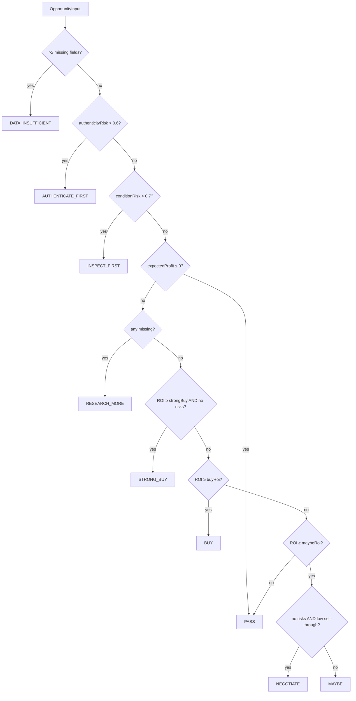

# Opportunity Decision Engine

The opportunity engine lives in `packages/opportunity-engine/src/index.ts`.

## Decisions

9 outcomes: BUY, STRONG_BUY, NEGOTIATE, MAYBE, PASS, RESEARCH_MORE, AUTHENTICATE_FIRST, INSPECT_FIRST, DATA_INSUFFICIENT.

## Decision Logic

1. If > 2 missing data fields → DATA_INSUFFICIENT
2. If authenticityRisk > 0.6 → AUTHENTICATE_FIRST
3. If conditionRisk > 0.7 → INSPECT_FIRST
4. If expectedProfit ≤ 0 → PASS
5. If any missing data → RESEARCH_MORE
6. If ROI ≥ strongBuyRoi AND confidence ≥ min AND no risks → STRONG_BUY
7. If ROI ≥ buyRoi → BUY
8. If ROI ≥ maybeRoi:
   - If no risks AND low sell-through → NEGOTIATE
   - Else → MAYBE
9. Else → PASS

## Output

Every `OpportunityResult` includes:

- decision
- reasons (array)
- risks (array)
- missingData (array)
- maximumRecommendedPurchasePrice
- optional suggestedNegotiationTarget
- recommendedMarketplaces (array)
- recommendedNextStep
- confidence

## Critical Rule

**Never make autonomous purchasing decisions.** The engine produces recommendations only. An external authority contract must explicitly permit execution before any purchase action is taken.

## Mermaid: Opportunity Decision

