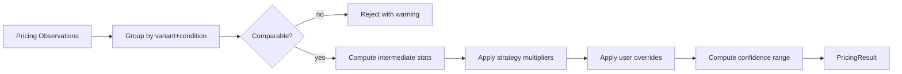

# Pricing Engine

The pricing engine lives in `packages/pricing/src/index.ts`.

## Output

Every `PricingResult` includes:

- estimatedMarketValue (MoneyRange: low / high / midpoint)
- fastSalePrice, balancedPrice, maximumMarginPrice
- minimumAcceptablePrice
- recommendedListPrice
- recommendedOfferFloor
- confidenceRange (low / high)
- dataFreshnessSeconds
- sourceCoverage
- comparableCount
- explanation (step-by-step)
- warnings

## Strategies

```typescript
type PricingStrategy =
  | 'QUICK_FLIP' | 'BALANCED' | 'MAX_MARGIN' | 'MARKET_MATCH'
  | 'CLEARANCE' | 'AGED_INVENTORY' | 'ENTERPRISE_POLICY' | 'CUSTOM';
```

Each strategy applies different multipliers to the estimated market value midpoint.

## Median Selection

- ≥ 3 sold comps → use soldMedian
- mix of active + sold → use blend
- active only → use activeMedian (with sell-through warning)
- no comps → midpoint = 0, confidence very low

## Critical Rule

**Never present a single precise value when evidence only supports a range.** The output is a `MoneyRange`, not a single `Money`.

## Custom Overrides

- `customListingPrice` overrides `recommendedListPrice` with `USER_ENTERED` status
- `minimumPrice` overrides `minimumAcceptablePrice`
- `seasonalityFactor` and `localDemandFactor` apply multiplicative adjustments

## Mermaid: Pricing Pipeline


