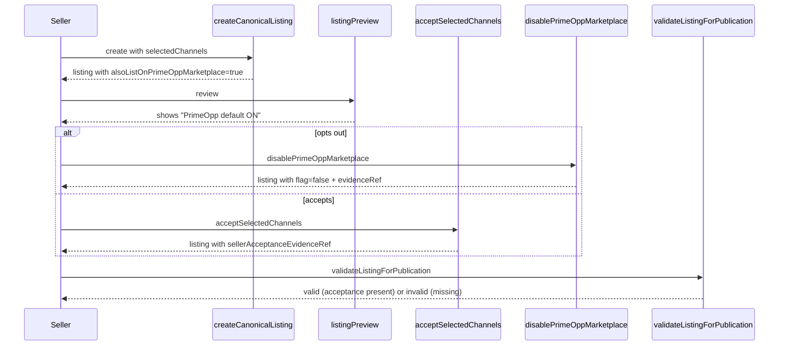

# PrimeOpp Marketplace Default Listing Support

Phase 19 of the mission requires that PrimeOpp Marketplace be a visible, reversible default for new listings. This is implemented in `packages/listing-contracts/src/index.ts`.

## Requirements Met

1. **Setting is visible**: `alsoListOnPrimeOppMarketplace` is a top-level field on `CanonicalListing`.
2. **User can disable it**: `disablePrimeOppMarketplace(listing, opts)` produces a new listing with the flag set to false and removes `primeopp-marketplace` from `selectedChannels`.
3. **No hidden enrollment**: The flag defaults to `true` only when `createCanonicalListing` is called. There is no automatic enrollment path.
4. **No dark pattern**: `listingPreview(listing)` shows the flag state explicitly with "PrimeOpp default ON" or "PrimeOpp default OFF" markers.
5. **Listing preview shows all selected channels**: `listingPreview` lists every channel in `selectedChannels` with PrimeOpp marker where applicable.
6. **Fee schedule disclosed**: The default PrimeOpp Marketplace fee schedule is documented in `docs/FEE_ENGINE.md` and the schedule is registered with `defaultPrimeOppMarketplaceFeeSchedule()`.
7. **Seller must approve final publication policy**: `acceptSelectedChannels(listing, opts)` produces evidence of acceptance; `validateListingForPublication` rejects listings without acceptance evidence.
8. **Enterprise administrators may configure organization defaults**: `TenantConfig.defaultAlsoListOnPrimeOppMarketplace` and `Organization.defaultAlsoListOnPrimeOppMarketplace` allow org-level defaults.
9. **Users retain listing-level control**: `disablePrimeOppMarketplace` overrides any org-level default.
10. **Explicit evidence of acceptance**: Both `disablePrimeOppMarketplace` and `acceptSelectedChannels` return an `evidenceRef` and set `sellerAcceptanceEvidenceRef` on the listing.

## Mermaid: PrimeOpp Default Flow

## Critical Rule

**Do not publish anything externally in this mission.** All publication is via local test adapters only.
