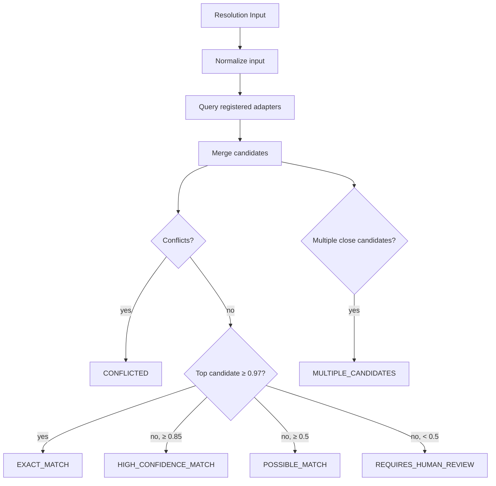

# Product Identity Resolution

The product identity resolver lives in `packages/product-identity/src/index.ts`.

## Resolution States

```typescript
type ResolutionState =
  | 'EXACT_MATCH' | 'HIGH_CONFIDENCE_MATCH' | 'POSSIBLE_MATCH'
  | 'MULTIPLE_CANDIDATES' | 'VARIANT_AMBIGUITY' | 'CONFLICTED'
  | 'NO_MATCH' | 'REQUIRES_HUMAN_REVIEW';
```

## Resolution Flow



## Input Types

- `inputFromBarcode(payload)` — barcode-driven resolution
- `inputFromOcrAndImage(ocr, imageMatch?)` — OCR + image match
- `inputFromText(text)` — manual text query

## Output

The resolver returns a `ResolutionResult` with:

- `state` — one of the 8 resolution states
- `candidates` — sorted by confidence, each with matched/conflicting/missing fields
- `selectedCandidateId` — set only for EXACT/HIGH/POSSIBLE_MATCH
- `explanation` — step-by-step reasoning
- `warnings` — anything notable
- `recommendedNextAction` — what the caller should do next

Never silently choose a low-confidence match.
