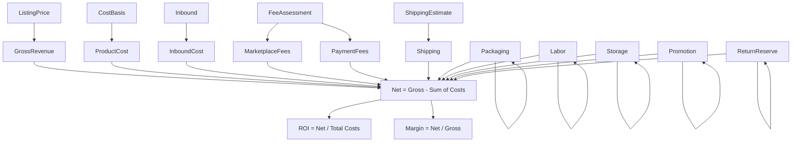

# Profit & ROI Engine

The profit engine lives in `packages/profit-engine/src/index.ts`.

## Output

Every `ProfitResult` includes:

- grossRevenue, productCost, inboundCost
- marketplaceFees, paymentFees
- shipping, packaging, labor, storage, promotion, returnReserve
- netProfit, margin, roi
- breakEvenPrice
- maximumBuyPrice
- optional profitPerDay, annualizedReturn
- per-line `statuses` (EpistemicStatus)
- warnings

## Mermaid: Profit Calculation

## Epistemic Status

Every line in the result is tagged with its epistemic status. The status propagates: if any input is ESTIMATED, downstream sums are ESTIMATED. Currency mismatches produce UNKNOWN status and a warning (the engine does NOT throw on currency mismatch).

## Critical Rule

**Never hide uncertainty.** Every line has its own status; the caller can display per-line confidence.
