# Architecture

## Package dependency graph

```mermaid
graph TD
  contracts[contracts]
  schemas[schemas] --> contracts
  registry[retailer-registry] --> contracts
  ingestion[source-ingestion] --> contracts
  crawler[crawler-contracts] --> contracts
  browser[browser-contracts] --> contracts
  feed[feed-contracts] --> contracts
  prodnorm[product-normalization] --> contracts
  offnorm[offer-normalization] --> contracts
  coupon[coupon-engine] --> contracts
  promo[promotion-engine] --> contracts
  hist[historical-pricing] --> contracts
  avail[availability-engine] --> contracts
  restock[restock-engine] --> contracts
  rarity[rarity-engine] --> contracts
  dv[deal-validation] --> contracts
  dv --> avail
  dv --> offnorm
  ds[deal-scoring] --> contracts
  ds --> offnorm
  ds --> hist
  resale[resale-opportunity] --> contracts
  aff[affiliate-engine] --> contracts
  alert[alert-engine] --> contracts
  pub[publishing-contracts] --> contracts
  amos[amos-contracts] --> contracts
  comm[community-submissions] --> contracts
  tenant[tenant-config] --> contracts
  evidence[evidence] --> contracts
  obs[observability] --> contracts
  asdk[adapter-sdk] --> contracts
  atk[adapter-testkit] --> contracts
  atk --> asdk
  sdk[sdk] --> contracts
  sdk --> registry
  sdk --> ingestion
  sdk --> prodnorm
  sdk --> offnorm
  sdk --> coupon
  sdk --> promo
  sdk --> hist
  sdk --> avail
  sdk --> restock
  sdk --> rarity
  sdk --> dv
  sdk --> ds
  sdk --> resale
  sdk --> aff
  sdk --> alert
  sdk --> pub
  sdk --> amos
  sdk --> comm
  sdk --> tenant
  sdk --> evidence
  sdk --> obs
  sdk --> asdk
  cli[cli] --> contracts
  cli --> sdk
```

## Layering

1. **Contracts layer** — `contracts`, `schemas`. Pure types and JSON Schemas.
   No runtime logic beyond money/ids utilities.

2. **Domain layer** — `retailer-registry`, `product-normalization`,
   `offer-normalization`, `coupon-engine`, `promotion-engine`,
   `historical-pricing`, `availability-engine`, `restock-engine`,
   `rarity-engine`, `deal-validation`, `deal-scoring`, `resale-opportunity`.
   Pure domain logic; depends only on contracts (and occasionally on each other
   through stable interfaces).

3. **Integration layer** — `crawler-contracts`, `browser-contracts`,
   `feed-contracts`, `affiliate-engine`, `alert-engine`,
   `publishing-contracts`, `amos-contracts`, `community-submissions`.
   Contracts and local-only adapters for external systems.

4. **Platform layer** — `tenant-config`, `evidence`, `observability`,
   `adapter-sdk`, `adapter-testkit`. Cross-cutting concerns.

5. **Facade layer** — `sdk` composes everything; `cli` exposes commands.

## Key invariants

- Products consume reusable capabilities; they never duplicate shared platform infrastructure.
- Retailers and data providers are accessed only through adapters.
- Browser automation uses the canonical Browser Operator contract (this package only defines the seam).
- Secrets are represented by references (suitable for Prime Vault), never raw credentials.
- No silent failures; every fallback identifies that it executed and why.
- Every job terminates in an explicit state.
- Runtime evidence outweighs documentation claims.
