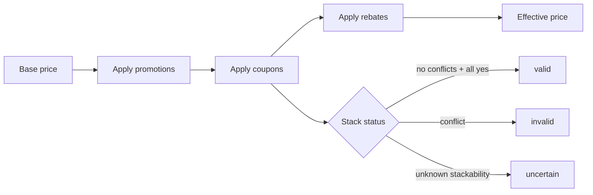

# Coupon and Promotion Engine

`coupon-engine` evaluates deterministic stacks. Stack status is one of
`valid` / `invalid` / `uncertain`:

- `valid`: all coupons explicitly stackable, no conflicts
- `invalid`: at least one conflict or non-stackable coupon
- `uncertain`: at least one `unknown` stackability, no conflicts

NEVER claims coupon compatibility without evidence. `promotion-engine`
evaluates 19 promotion types (percentage, fixed, BOGO, buy-more-save-more,
category, member, credit-card, gift-card, rebate, loyalty-points,
store-cash, clearance, markdown, bundle, free-shipping, first-order,
app-only, email-only, regional).

