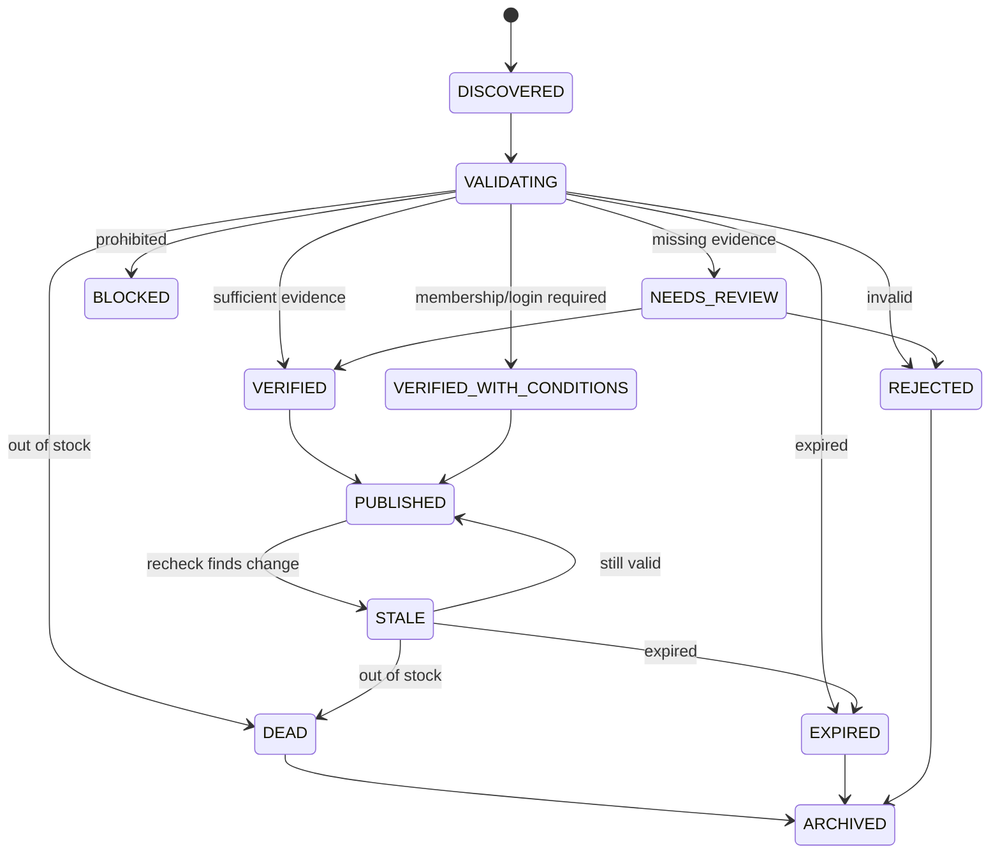

# Deal Lifecycle

16 lifecycle steps: DISCOVER, NORMALIZE, MATCH_PRODUCT,
CALCULATE_EFFECTIVE_PRICE, VALIDATE_PROMOTION, CHECK_HISTORY,
CHECK_AVAILABILITY, SCORE, CHECK_AFFILIATE, MODERATE, APPROVE,
DISTRIBUTE, RECHECK, UPDATE, EXPIRE, ARCHIVE.

Terminal states: PUBLISHED, REJECTED, DEAD, EXPIRED, FAILED, ARCHIVED.
Every deal has a terminal state. No silent disappearance.

