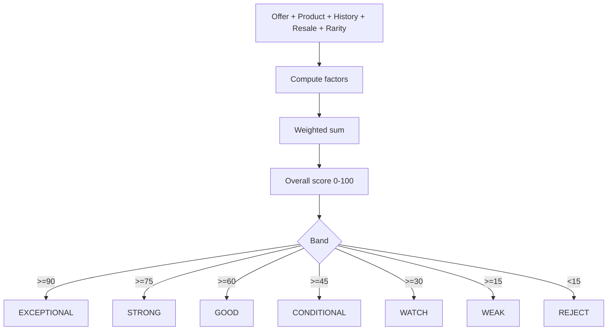

# Deal Scoring

`deal-scoring` produces a `DealScoreSet` with 8 sub-scores:
consumerValue, resellerOpportunity, affiliateOpportunity, scarcity,
confidence, urgency, contentPotential, overall.

Every score includes explainable factors (key, weight, raw, weighted,
rationale). Bands: EXCEPTIONAL (90+), STRONG (75+), GOOD (60+),
CONDITIONAL (45+), WATCH (30+), WEAK (15+), REJECT (<15),
INSUFFICIENT_DATA (5+ missing fields).

