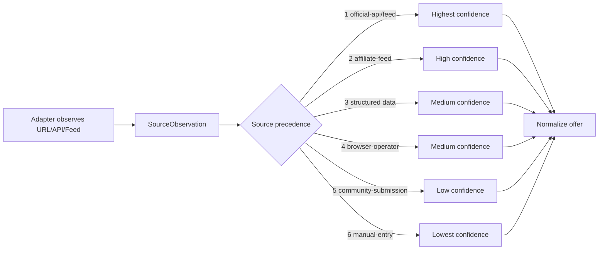

# Canonical Retailer Model

The `Retailer` type is defined in `@primeopp-deal-intelligence/contracts`.
The registry is shipped in `@primeopp-deal-intelligence/retailer-registry`.

## Required fields

Every retailer MUST include: canonical identifier, name, supported regions,
official domains, source methods, access methods, affiliate availability,
terms reference, permitted automation modes, rate-limit metadata,
robots-policy reference, browser requirement, login requirement,
membership requirement, evidence freshness, and health status.

## Retailer types

- `national-chain`
- `regional-chain`
- `local-store`
- `online-only`
- `wholesaler`
- `membership-club`
- `outlet`
- `liquidation`
- `manufacturer-store`
- `marketplace`

## Starter retailers (20)

Amazon, Walmart, Target, Lowe's, Home Depot, Best Buy, Costco, Sam's Club,
Harbor Freight, Nike, Adidas, Victoria's Secret, Bath & Body Works, Macy's,
Kohl's, CVS, Walgreens, Office Depot, Staples, Newegg.

## Legal review status

Every retailer in the starter registry has `legalReviewStatus: 'pending'`.
**No retailer claims live scraping support.** External live verification is
explicitly pending and must be performed by a human-legal-reviewed adapter
before any live retrieval is enabled.

## Retailer ingestion flow

