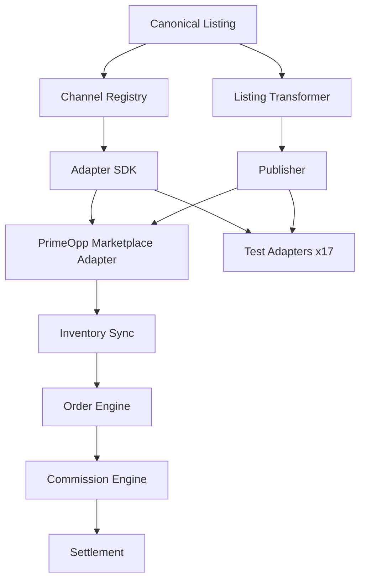

# Architecture

**Package:** primeopp-marketplace-platform

**Last updated:** 2026-01-01

## Overview

The PrimeOpp Marketplace Platform is a TypeScript monorepo using npm workspaces. All packages share a common contracts layer and depend on adapter-sdk for stable channel interfaces.

## Design Principles

- Products consume reusable capabilities — they do not duplicate shared platform infrastructure
- Foundry is the sole canonical execution runtime (future integration, not implemented here)
- E.V.E. independently verifies material execution results (future integration, not implemented here)
- AI providers must remain interchangeable
- Marketplace providers must be accessed through adapters
- Browser automation must use the canonical Browser Operator contract
- Identity must remain behind the canonical Identity Runtime
- Secrets must be represented through references suitable for Prime Vault
- Runtime evidence outweighs documentation claims
- No silent failures are permitted
- Every fallback must identify that it executed and why
- Every workflow must terminate in an explicit state

## Monorepo Layout

See README.md for the full package list. Each package has its own tsconfig.json (composite project) and exports from dist/.

## Mermaid Diagram

